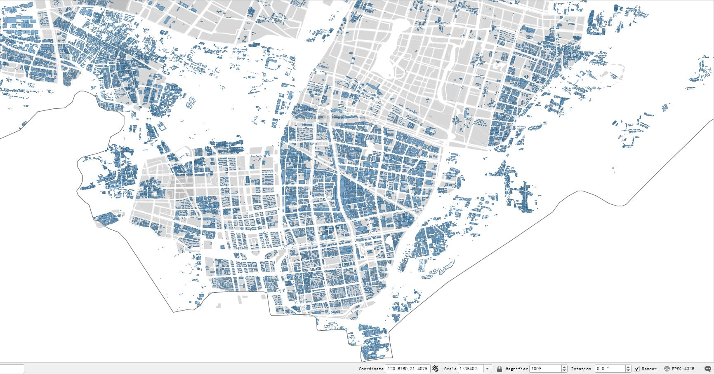
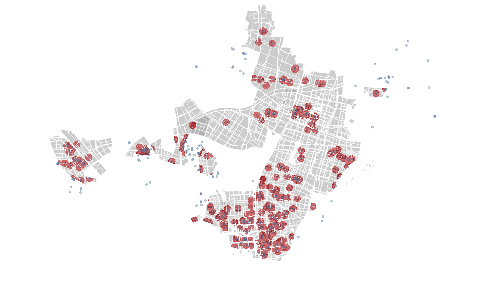
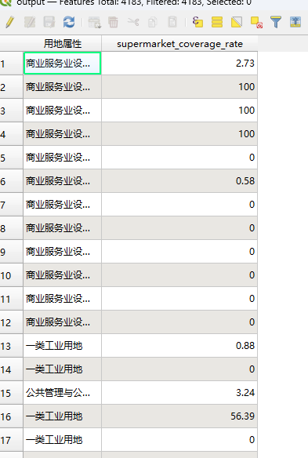
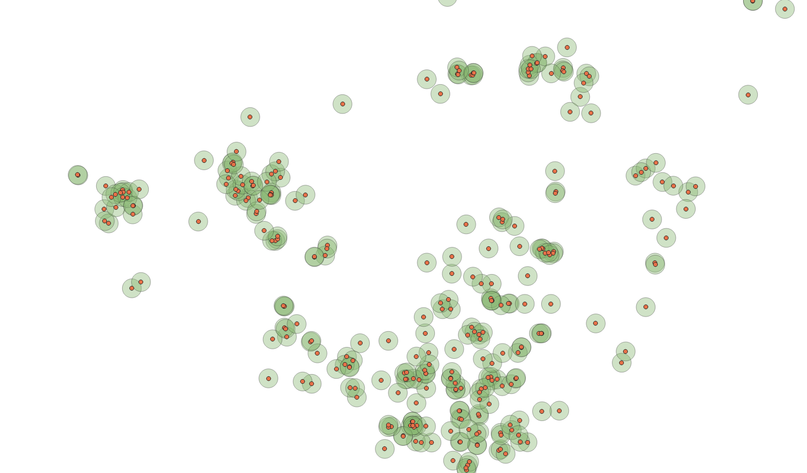
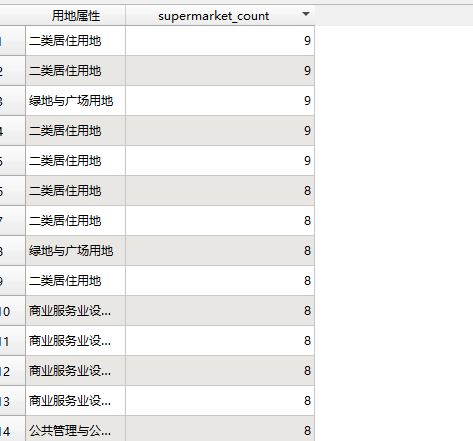
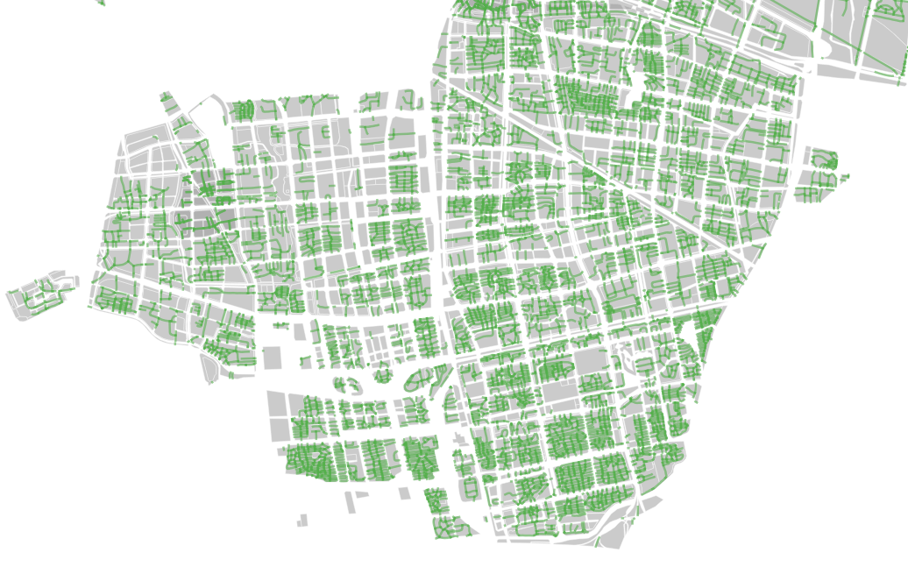
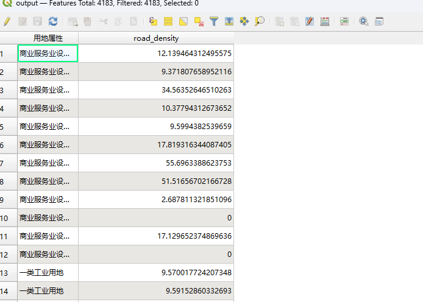
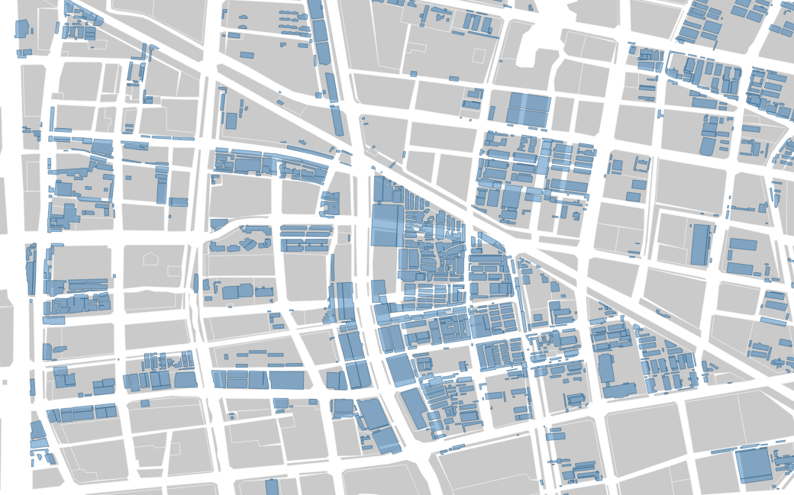
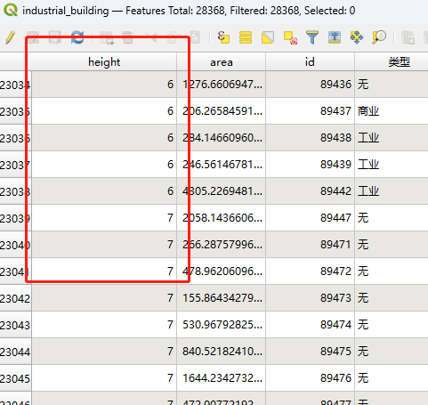

中文版         

# 城市更新指标计算器(v0.1.0) 

### 主要功能

- 以地块为单位的各类城市更新指标计算(覆盖率、密度、容积等)
- 高德POI部分类型正则筛选参考 (eg. 菜市场, 超市, 快递站点...)

### 数据样例

- 
- 
- 
- 

### 模块介绍
#### 1. Calculator.PointIndex
 -  以地块为单位的POI 覆盖率(1.菜市场Poi buffer300m，计算地块菜市场覆盖率)
    -   算法原理图示：
        -   
            
原始POI及地块数据

        -    
            
根据POI生成缓冲区(重叠部分合并)

        -    
            
提取缓冲区与地块相交部分

        -    
            
分别对地块进行缓冲区面积/地块总面积，计算得到结果

 -  地块内POI(buffer)数量 (如菜市场buffer 300m后，对所有地块计算含有菜市场缓冲区的数量
 (当不需要缓冲区时设置buffer为0.0001即可))
    -   算法原理图示：
            -   
                
原始POI及地块数据

            -    
                
根据POI生成缓冲区(重叠部分不再合并)

            -    
                
提取缓冲区与地块相交部分(当一个地块被多个缓冲区覆盖时会出现有大量缓冲区重叠的区域)

            -    
                
计算与地块相交的缓冲区数量，得到输出结果

#### 2. Calculator.LineIndex
 -  以地块为单位的路网密度计算
    -   算法原理图示：
        -   
            
原始路网及地块数据

        -    
            
提取与地块重叠的路网部分

        -    
            
计算(路网长度总和(km)/地块面积(km²))

#### 3. Calculator.AoiIndex
 -  以地块为单位的面数据指标计算
 -  覆盖率类参考POI
 -  building_floor_area地块建筑面积计算：
    -   算法原理图示：
        -   
            
原始建筑数据及地块数据

        -   
            
建筑数据要求有一个代表高度的字段

        -    
            
提取与地块重叠的建筑部分(红色部分)

        -    
            
通过高度推算层数，再使用建筑占地面积*层数得到建筑面积

### 涵盖指标 (持续施工中)

| 指标名称 | 计算方法 | 数据来源 |
| :-----| ----: | :----: |
| 生活服务设施覆盖率 | buffer 300m | 高德POI |
| 超市覆盖率 | buffer 300m | 高德POI |
| 便利店覆盖率 | buffer 300m | 高德POI |
| 菜市场覆盖率 | buffer 300m | 高德POI |
| 快递站点覆盖率 | buffer 300m | 高德POI |
| 社区服务点覆盖率 | buffer 300m | 高德POI |
| 便民服务设施覆盖率 | buffer 300m | 高德POI |
| 体育设施覆盖率 | buffer 300m | 高德POI |
| 充电站覆盖率 | buffer 1000m | 百度充电桩查询 |
| 充电桩数量 | buffer 1000m后count | 百度充电桩查询 |
| 加油站覆盖率 | buffer 1000m | 百度加油站查询 |
| 公园绿地覆盖率 | 点位buffer300m，面积buffer500m | 高德poi，百度aoi |
| 轨道站点覆盖率 | buffer 500m | 高德POI |
| 公交站点覆盖率 | buffer 300m | 高德POI |
| 绿地面积 | 地块内，绿地面积占比 | 高德poi，百度aoi |
| 居住小区数量 | buffer 300m后count | 链家小区 |
| 企业数量 | 地块内企业数量 | 爱企查 |
| 屋顶面积 | 地块内屋顶面积 |  |
| 住宅屋顶面积 |  |  |r
| 容积率 |  |  |
| 路网密度 | 地块内道路总长度/地块面积 | osm+qq |
